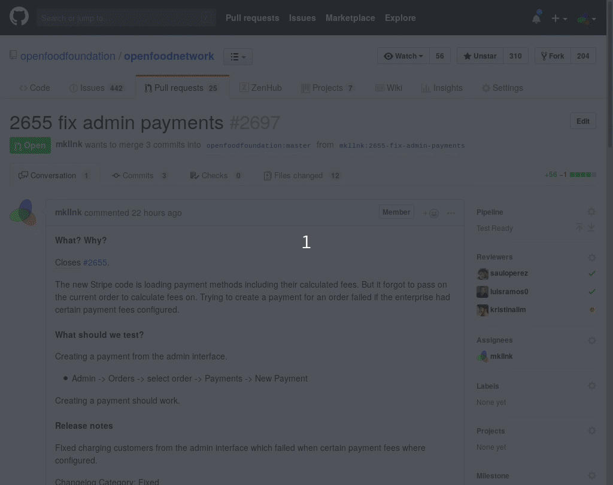

> **This is an experimental feature with the Australian staging server. Please report to Maikel on Slack if you encounter any problems.**

You can stage pull requests to https://staging.openfoodnetwork.org.au/ yourself. You need to signup with Semaphore, then a developer has to give you access to Semaphore CI. Then you can navigate to the staging process from any pull request. But before you stage, follow the checklist to prevent conflicts:

- Check that nobody else is using the staging server.
- Check that the pull request is approved, in the *Test Ready* column and has no test failures or merge conflicts. It needs Three big green ticks at the bottom of the pull request (nothing red).
- Let others know that you are staging it by commenting on the pull request and putting a label on.

A deployment usually takes between 3 and 10 minutes. But sometimes the page doesn't update itself properly. Reload the page after five minutes to see if it's already green and deployed.

What happens technically:

- The pull request and master are merged so that the result is staged and tested.
- The merge commit is pushed to the staging server.
- The server resets the database to its baseline data.
- A deploy script is run.

What to do when you've finished testing?
- You can put your testing notes on the PR like usual.
- Then you can stage the next PR, without needing to wait for the previous PR to be pushed. Just remember to switch the staged label over.
